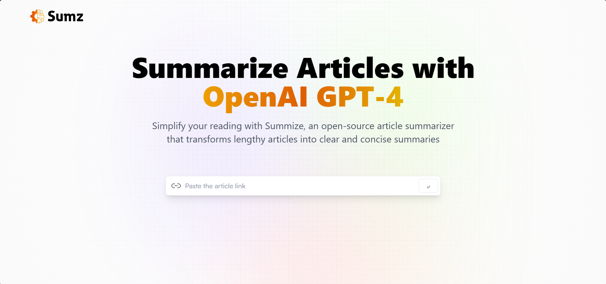

<div align="center">
</div>

## Description

- An article summarizer application using OpenAI GPT model .

## Technologies used

- React: A popular JavaScript library for building user interfaces.
- Redux-toolkit: A state management library for managing the global state of the application.
- TailwindCSS: A utility-first CSS framework for creating responsive and modern UI components.
- Vite: A fast build tool for modern web development.
- RapidAPI Summarizer: This is an API which extracts news/article body from a URL and uses GPT to summarize (and optionally translate) the article content..

## Screenshots

<p align="center"></p>

<br/>

## 🛠️ Installation Steps:

<p>1. Clone the repository</p>

```
git clone https://github.com/OmarZahrah/AI-ArticleSummarizer.git
```

<p>2. Install the required dependencies </p>

```
npm install
```

<p>3. Start the development server</p>

```
npm run dev
```

<br/>
